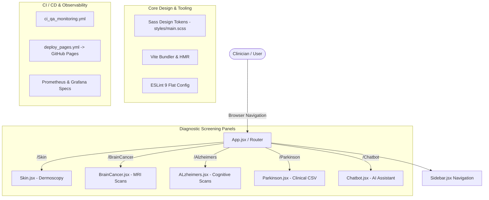

# 🏥 CareAI (IA-Care)

<div align="center">

[](https://maryam-elalami.github.io/IA-Care/)
[](https://eniad.ump.ma/)
[](https://github.com/Maryam-ELALAMI/IA-Care)
[](https://github.com/Maryam-ELALAMI/IA-Care/actions)
[](https://github.com/Maryam-ELALAMI/IA-Care/wiki)
[](LICENSE)

<br/>

**CareAI (`IA-Care`)** is a modern, responsive web application and clinical screening dashboard designed for multi-disease medical detection (Skin Cancer, Brain Tumor, Alzheimer's, and Parkinson's) paired with a conversational healthcare assistant interface.

Developed as a flagship academic project at **ENIAD** (*École Nationale d'Intelligence Artificielle et du Digital*).

[🌐 Live Deployment](https://maryam-elalami.github.io/IA-Care/) • [📖 Official Wiki](https://github.com/Maryam-ELALAMI/IA-Care/wiki) • [🚀 Getting Started](#-getting-started) • [👥 Team](#-team--contributors)

</div>

---

## 📌 Table of Contents
- [🌟 Key Highlights & Live Demo](#-key-highlights--live-demo)
- [🎓 ENIAD Academic Context & Favorite School Project](#-eniad-academic-context--favorite-school-project)
- [✨ Features & Diagnostic Modules](#-features--diagnostic-modules)
- [🏗️ System Architecture](#️-system-architecture)
- [📁 Project Organization](#-project-organization)
- [🚀 Getting Started](#-getting-started)
- [🧪 Quality Assurance & CI/CD](#-quality-assurance--cicd)
- [👥 Team & Contributors](#-team--contributors)
- [📜 License](#-license)

---

## 🌟 Key Highlights & Live Demo

- **🚀 Live Production Deployment**: Hosted live on GitHub Pages with automated CI/CD:
  👉 **[https://maryam-elalami.github.io/IA-Care/](https://maryam-elalami.github.io/IA-Care/)**
- **⚡ Modern Frontend Stack**: Powered by **React 18**, **Vite**, and **Dart Sass** for lightning-fast HMR and optimized production bundles.
- **🛡️ 100% Green CI & Code Quality**: Verified with automated ESLint 9 flat config, build checks, and monitoring evaluation suites.
- **🎨 Responsive Clinical UI**: Clean sidebar navigation, drag-and-drop file ingestion, image validation, and tailored telemetry.

---

## 🎓 ENIAD Academic Context & Favorite School Project

This project is officially classified under the **Favorite List of Academic School Projects** at:

> **ENIAD — École Nationale d'Intelligence Artificielle et du Digital**  
> *Université Mohammed Premier (UMP), Berkane, Morocco*  
> Cycle Ingénieur en Intelligence Artificielle & Digital Health Applications

### 🏆 Academic Significance
- **Domain**: Artificial Intelligence in Healthcare & Computer Vision for Early Clinical Screening.
- **Multimodal Focus**: Image classification (Dermoscopy, MRI neuroimaging) combined with tabular clinical feature vectors (vocal/motor biomarker datasets for Parkinson's).
- **Curriculum Alignment**: Designed to demonstrate the complete lifecycle of a medical AI application—from user-centric interface design and data ingestion to automated model inferencing and continuous QA monitoring.

---

## ✨ Features & Diagnostic Modules

| Module | Route | Modality | Description |
|---|---|---|---|
| **Skin Cancer Detection** | `/Skin` | Dermoscopy Images (`.png`, `.jpg`, `.jpeg`) | Drag-and-drop skin lesion screening with client-side image validation. |
| **Brain Cancer Detection** | `/BrainCancer` | Brain MRI Scans | Interactive upload and visual inspection panel for intracranial anomalies. |
| **Alzheimer's Screening** | `/Alzheimers` | Neuroimaging Scans | Two-stage screening panel with file preview and explicit diagnostic trigger. |
| **Parkinson's Assessment**| `/Parkinson` | Tabular Biomarkers (`.csv`) | Clinical tabular dataset ingestion for motor/voice acoustic analysis. |
| **CareAI Assistant** | `/Chatbot` | Conversational Interface | Healthcare assistant interface designed for preliminary triage guidance. |

---

## 🏗️ System Architecture



---

## 📁 Project Organization

```text
IA-Care/
├── .github/
│   └── workflows/
│       ├── ci_qa_monitoring.yml    # Continuous Integration & Linting
│       └── deploy_pages.yml        # GitHub Pages Auto-Deployment
├── components/
│   └── Sidebar.jsx                 # Persistent responsive sidebar navigation
├── pages/
│   ├── Skin.jsx                    # Skin cancer detection panel
│   ├── BrainCancer.jsx             # Brain tumor scan inspection panel
│   ├── ALzheimers.jsx              # Alzheimer's staging panel
│   ├── Parkinson.jsx               # Parkinson's tabular dataset assessment
│   ├── Chatbot.jsx                 # AI healthcare conversational assistant
│   └── assets/                     # Diagnostic UI imagery & logos
├── styles/
│   ├── _variables.scss             # Design system tokens (colors, typography)
│   └── main.scss                   # Global layout, burger toggle, responsive SCSS
├── monitoring/
│   ├── logger.js / logger.py       # Standardized telemetry & structured logging
│   ├── health.js / health.py       # Health controllers & liveness probes
│   ├── prometheus/                 # Prometheus scrape configurations
│   └── grafana/                    # Observability monitoring dashboard JSON
├── scripts/
│   └── eval_harness.js             # Automated quality index & test evaluation
├── tests/
│   ├── monitoring.test.js          # Observability unit tests
│   └── test_monitoring_and_qa.py   # Python test suite
├── index.html                      # HTML5 root template
├── index.jsx                       # Application DOM mount
├── vite.config.js                  # Vite configuration & base paths
├── package.json                    # Project metadata, scripts & dependencies
└── README.md                       # Master project documentation
```

---

## 🚀 Getting Started

### Prerequisites
- **Node.js**: v18.x or v20.x LTS
- **npm**: v9.x or higher

### Installation & Local Run

1. **Clone the repository:**
   ```bash
   git clone https://github.com/Maryam-ELALAMI/IA-Care.git
   cd IA-Care
   ```

2. **Install dependencies:**
   ```bash
   npm install
   ```

3. **Start development server:**
   ```bash
   npm run dev
   ```
   Open [http://localhost:3000](http://localhost:3000) in your browser.

4. **Build production bundle:**
   ```bash
   npm run build
   ```
   Outputs an optimized production bundle to `dist/`.

5. **Run code quality linter:**
   ```bash
   npm run lint
   ```

---

## 🧪 Quality Assurance & CI/CD

The repository implements automated CI/CD pipelines verified on every push and pull request:
- **Linting & Code Consistency**: ESLint flat config with React and Jest global rules.
- **Production Asset Validation**: Complete Vite production build and tree-shaking verification.
- **Continuous Deployment**: Automated GitHub Pages workflow deploying directly to production.
- **Observability Specs**: Metrics and telemetry specifications validated via `eval_harness.js`.

---

## 👥 Team & Contributors

This project was built by a collaborative student engineering team from **ENIAD**:

| Contributor | Role & Contributions | Contact / Profile |
|---|---|---|
| **Maryam EL-ALAMI** | **Project Lead & AI Medical Research**<br/>Architecture, diagnostic design, and repository maintainer. | [](https://github.com/Maryam-ELALAMI) |
| **Hanae Ouaamar** | **Team Member & Clinical Data / Model Contributor**<br/>Dataset curation, screening workflow research, and diagnostic requirements. | [](mailto:Hanaeouaamar@gmail.com) [](https://github.com/hanae-ouaamar) |
| **Oussama EL HADJI (Bosaj)** | **Full-Stack & DevOps Engineer**<br/>Vite migration, frontend architecture, CI/CD pipelines, and observability framework. | [](https://github.com/Bosaj) [](https://github.com/sponsors/Bosaj) |
| **Oualid Ghaffari** | **Team Contributor**<br/>Initial panel prototypes and client-side routing. | [](https://github.com/ghaffariOualid) |

---

## 📚 Documentation & Project Wiki

Explore comprehensive project documentation in our **[Official GitHub Wiki](https://github.com/Maryam-ELALAMI/IA-Care/wiki)**:
- 📖 [Home Page](https://github.com/Maryam-ELALAMI/IA-Care/wiki/Home)
- 🏛️ [Architecture & Design](https://github.com/Maryam-ELALAMI/IA-Care/wiki/Architecture-and-Design)
- 🚀 [Getting Started Guide](https://github.com/Maryam-ELALAMI/IA-Care/wiki/Getting-Started)
- 📊 [Monitoring, Observability & QA](https://github.com/Maryam-ELALAMI/IA-Care/wiki/Monitoring-and-QA)
- 🛠️ [Developer Guide](https://github.com/Maryam-ELALAMI/IA-Care/wiki/Developer-Guide)

---

## 📜 License

This project is licensed under the [MIT License](LICENSE).
